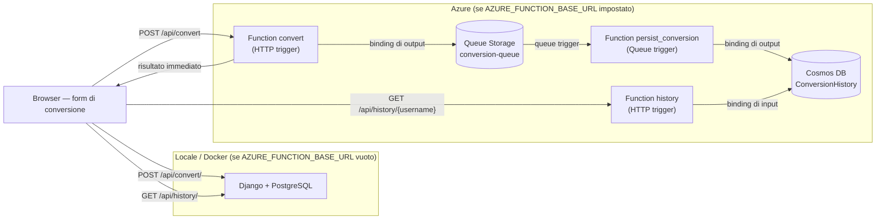

#  Currency Converter


> 🇫🇷 Français | 🇮🇹 [Italiano](#-convertitore-di-valute)

---

## 🇫🇷 Convertisseur de Devises

Application web de conversion de devises en temps réel, développée avec Python/Django et déployée en production sur Render.

###  Lancer le projet (Docker)

```bash
git clone git@github.com:Fred0242/currency-converter.git
cd currency-converter
cp .env.example .env
# Remplis les variables dans .env
docker compose up --build
# Accède à l'app sur http://127.0.0.1:8000
```

---

###  Fonctionnalités

-  Conversion en temps réel via l'API [Frankfurter](https://www.frankfurter.app/)
-  Drapeaux des pays pour chaque devise
-  Devises supportées : EUR, USD, GBP, JPY, CHF, CAD, AUD, XAF (Franc CFA)
-  Authentification (inscription, connexion, déconnexion)
-  Historique personnel des conversions (utilisateurs connectés)
-  Frontend en `fetch()` (HTTP trigger) : le formulaire écrit/lit les données via des appels HTTP JSON, sans rechargement de page
-  Historique des conversions persisté dans **Azure Cosmos DB**, écrit de façon asynchrone via une **Queue Storage** et des **Azure Functions** (HTTP + Queue trigger, bindings d'entrée/sortie)
-  Interface responsive et moderne

---

###  Stack technique

| Technologie | Rôle |
|---|---|
| Python 3.13 | Langage principal |
| Django 5.x | Framework web |
| PostgreSQL 16 | Base de données (comptes, historique local) |
| Azure Functions (Python) | HTTP + Queue trigger, bindings Cosmos DB (écriture/lecture des conversions) |
| Azure Queue Storage | Découplage écriture (accord asynchrone des conversions) |
| Azure Cosmos DB | Persistance gérée de l'historique côté Azure (Serverless) |
| Docker + Compose | Conteneurisation |
| GitHub Actions | CI/CD |
| Render | Déploiement production |
| Gunicorn | Serveur WSGI production |
| Whitenoise | Fichiers statiques |

---

###  Architecture du projet


L'écriture côté Azure est **asynchrone** : `convert` répond tout de suite à l'utilisateur et dépose un message sur la queue ; c'est `persist_conversion` (déclenchée par la queue) qui écrit réellement sur Cosmos DB, en découplant le calcul de la persistance.

```
currency_converter/
│
├── core/                   ← Configuration Django
│   ├── settings.py         ← AZURE_FUNCTION_BASE_URL, DB, etc.
│   ├── urls.py
│   └── wsgi.py
│
├── converter/              ← App principale
│   ├── models.py           ← Modèle ConversionHistory
│   ├── views.py            ← Logique de conversion + API JSON (convert_api, history_api)
│   ├── services.py         ← Appel API Frankfurter
│   ├── urls.py              ← Routes /api/convert/ et /api/history/
│   ├── templates/           ← Frontend en fetch() (HTTP trigger)
│   └── tests.py
│
├── users/                  ← App authentification
│   ├── views.py
│   ├── urls.py
│   └── templates/
│
├── azure_function/          ← Azure Functions (Python)
│   ├── function_app.py     ← convert (HTTP+queue out), persist_conversion (queue in+Cosmos out), history (HTTP+Cosmos in)
│   ├── requirements.txt
│   └── host.json
│
├── .github/workflows/      ← CI/CD GitHub Actions
│   └── ci.yml
│
├── Dockerfile              ← Image Docker
├── docker-compose.yml      ← Orchestration locale
├── railway.toml            ← Configuration Render
└── requirements.txt        ← Dépendances Python
```

---

###  Installation locale (via Docker)

#### Prérequis
- Docker Desktop
- Git

#### Étapes

```bash
# 1. Clone le repo
git clone git@github.com:Fred0242/currency-converter.git
cd currency-converter

# 2. Crée le fichier .env
cp .env.example .env
# Remplis les variables dans .env

# 3. Lance l'app
docker compose up --build

# 4. Accède à l'app
# http://127.0.0.1:8000
```

---

###  API HTTP (écriture / lecture)

Le formulaire de conversion n'envoie plus un POST classique en rechargement de page : le frontend fait des appels `fetch()` en JSON vers une API HTTP.

| Endpoint | Méthode | Rôle |
|---|---|---|
| `/api/convert/` (Django) | POST | Calcule et écrit une conversion (historique sauvegardé si connecté) |
| `/api/history/` (Django) | GET | Lit l'historique de l'utilisateur connecté |
| `{AZURE_FUNCTION_BASE_URL}/api/convert` | POST | Calcule la conversion (**Azure Function**, HTTP trigger) puis dépose un message sur une **Queue Storage** (écriture asynchrone) |
| `{AZURE_FUNCTION_BASE_URL}/api/history/{username}` | GET | Lit l'historique depuis **Cosmos DB** (Azure Function, binding d'entrée) |

Le frontend bascule automatiquement vers l'Azure Function si la variable d'environnement `AZURE_FUNCTION_BASE_URL` est définie (voir `.env.example`) ; sinon il retombe sur l'API Django locale (utile en offline / sans compte Azure).

---

###  Azure Functions (Queue trigger + Cosmos DB)

Le dossier [`azure_function/`](azure_function/) contient 3 Azure Functions Python (modèle v2) formant un flux **event-driven** :

- `convert` (HTTP trigger) — calcule la conversion, répond immédiatement au frontend, et dépose un message JSON sur la queue via un **binding de sortie Queue Storage**
- `persist_conversion` (**Queue trigger**) — consomme le message et l'écrit sur Cosmos DB via un **binding de sortie Cosmos DB**
- `history` (HTTP trigger) — lit l'historique d'un utilisateur sur Cosmos DB via un **binding d'entrée Cosmos DB**

**Ressources Azure utilisées** : un Resource Group, un Storage Account (Queue Storage), un compte Cosmos DB (API NoSQL, capacité Serverless) et une Function App (plan Consumption, Python 3.12, Linux).

**Déploiement** (nécessite [Azure CLI](https://learn.microsoft.com/cli/azure/) et les [Azure Functions Core Tools](https://learn.microsoft.com/azure/azure-functions/functions-run-local)) :

```bash
# 1. Connexion
az login

# 2. Création des ressources (une seule fois)
az group create --name rg-currency-converter --location switzerlandnorth
az storage account create --name <storage-name> --resource-group rg-currency-converter --location switzerlandnorth --sku Standard_LRS
az storage queue create --name conversion-queue --account-name <storage-name>

az cosmosdb create --name <cosmos-account-name> --resource-group rg-currency-converter \
  --locations regionName=switzerlandnorth --capabilities EnableServerless
az cosmosdb sql database create --account-name <cosmos-account-name> --resource-group rg-currency-converter \
  --name CurrencyConverterDB
az cosmosdb sql container create --account-name <cosmos-account-name> --resource-group rg-currency-converter \
  --database-name CurrencyConverterDB --name ConversionHistory --partition-key-path /username

az functionapp create --name <function-app-name> --resource-group rg-currency-converter \
  --storage-account <storage-name> --consumption-plan-location switzerlandnorth \
  --runtime python --runtime-version 3.12 --functions-version 4 --os-type linux

# 3. Connecter la Function App à Cosmos DB
az functionapp config appsettings set --name <function-app-name> --resource-group rg-currency-converter \
  --settings "CosmosDbConnectionSetting=<cosmos-connection-string>"

# 4. Autoriser le frontend à appeler la Function (CORS)
az functionapp cors add --name <function-app-name> --resource-group rg-currency-converter \
  --allowed-origins "http://127.0.0.1:8000" "https://currency-converter-n35g.onrender.com"

# 5. Déploiement du code
cd azure_function
func azure functionapp publish <function-app-name> --python
```

Puis renseigner `AZURE_FUNCTION_BASE_URL=https://<function-app-name>.azurewebsites.net` dans `.env`.

---

###  Lancer les tests

```bash
# Avec Docker
docker compose exec web python manage.py test

# En local
env $(cat .env.test | xargs) python manage.py test
```

---

###  Auteur

**Franchir Madzou**
Étudiant en Web Solution Architecture — ITS ICT Piemonte

[](https://github.com/Fred0242)

---
---

## 🇮🇹 Convertitore di Valute

Applicazione web per la conversione di valute in tempo reale, sviluppata con Python/Django e distribuita in produzione su Render.

###  Avviare il progetto (Docker)

```bash
git clone git@github.com:Fred0242/currency-converter.git
cd currency-converter
cp .env.example .env
# Compila le variabili in .env
docker compose up --build
# Accedi all'app su http://127.0.0.1:8000
```

---

###  Funzionalità

-  Conversione in tempo reale tramite l'API [Frankfurter](https://www.frankfurter.app/)
-  Bandiere dei paesi per ogni valuta
-  Valute supportate : EUR, USD, GBP, JPY, CHF, CAD, AUD, XAF (Franco CFA)
-  Autenticazione (registrazione, accesso, disconnessione)
-  Storico personale delle conversioni (utenti connessi)
-  Frontend in `fetch()` (HTTP trigger): il form scrive/legge i dati tramite chiamate HTTP JSON, senza ricaricare la pagina
-  Storico delle conversioni persistito su **Azure Cosmos DB**, scritto in modo asincrono tramite una **Queue Storage** e delle **Azure Functions** (HTTP + Queue trigger, binding di input/output)
-  Interfaccia responsive e moderna

---

###  Stack tecnologico

| Tecnologia | Ruolo |
|---|---|
| Python 3.13 | Linguaggio principale |
| Django 5.x | Framework web |
| PostgreSQL 16 | Database (account, storico locale) |
| Azure Functions (Python) | HTTP + Queue trigger, binding Cosmos DB (scrittura/lettura conversioni) |
| Azure Queue Storage | Disaccoppiamento della scrittura (accodamento asincrono) |
| Azure Cosmos DB | Persistenza gestita dello storico lato Azure (Serverless) |
| Docker + Compose | Containerizzazione |
| GitHub Actions | CI/CD |
| Render | Deploy in produzione |
| Gunicorn | Server WSGI produzione |
| Whitenoise | File statici |

---

###  Architettura del progetto



La scrittura lato Azure è **asincrona**: `convert` risponde subito all'utente e accoda un messaggio sulla queue; è `persist_conversion` (attivata dalla queue) a scrivere realmente su Cosmos DB, disaccoppiando il calcolo dalla persistenza.

```
currency_converter/
│
├── core/                   ← Configurazione Django
├── converter/              ← App principale (form + API JSON convert_api / history_api)
├── users/                  ← App autenticazione
├── azure_function/          ← Azure Functions (Python): convert (HTTP+queue out), persist_conversion (queue in+Cosmos out), history (HTTP+Cosmos in)
├── .github/workflows/      ← CI/CD GitHub Actions
├── Dockerfile              ← Immagine Docker
├── docker-compose.yml      ← Orchestrazione locale
└── requirements.txt        ← Dipendenze Python
```

---

###  Installazione locale (via Docker)

#### Prerequisiti
- Docker Desktop
- Git

#### Passaggi

```bash
# 1. Clona il repository
git clone git@github.com:Fred0242/currency-converter.git
cd currency-converter

# 2. Crea il file .env
cp .env.example .env
# Compila le variabili in .env

# 3. Avvia l'app
docker compose up --build

# 4. Accedi all'app
# http://127.0.0.1:8000
```

---

###  API HTTP (scrittura / lettura)

Il form di conversione non invia più un POST classico con ricaricamento della pagina: il frontend usa `fetch()` in JSON verso un'API HTTP.

| Endpoint | Metodo | Ruolo |
|---|---|---|
| `/api/convert/` (Django) | POST | Calcola e scrive una conversione (storico salvato se loggato) |
| `/api/history/` (Django) | GET | Legge lo storico dell'utente connesso |
| `{AZURE_FUNCTION_BASE_URL}/api/convert` | POST | Calcola la conversione (**Azure Function**, HTTP trigger) poi accoda un messaggio su una **Queue Storage** (scrittura asincrona) |
| `{AZURE_FUNCTION_BASE_URL}/api/history/{username}` | GET | Legge lo storico da **Cosmos DB** (Azure Function, binding di input) |

Il frontend passa automaticamente all'Azure Function se la variabile d'ambiente `AZURE_FUNCTION_BASE_URL` è impostata (vedi `.env.example`); altrimenti usa l'API Django locale.

---

###  Azure Functions (Queue trigger + Cosmos DB)

La cartella [`azure_function/`](azure_function/) contiene 3 Azure Functions Python (modello v2) che formano un flusso **event-driven**: `convert` (HTTP trigger, scrive su Queue Storage tramite binding di output), `persist_conversion` (**Queue trigger**, scrive su Cosmos DB tramite binding di output) e `history` (HTTP trigger, legge da Cosmos DB tramite binding di input). Vedi la sezione francese sopra per i comandi di deploy (`az group create`, `az cosmosdb create`, `az functionapp create`, `func azure functionapp publish`, ecc.).

---

### Eseguire i test

```bash
# Con Docker
docker compose exec web python manage.py test

# In locale
env $(cat .env.test | xargs) python manage.py test
```

---

###  Autore

**Franchir Madzou**
Studente in Web Solution Architecture — ITS ICT Piemonte

[](https://github.com/Fred0242)